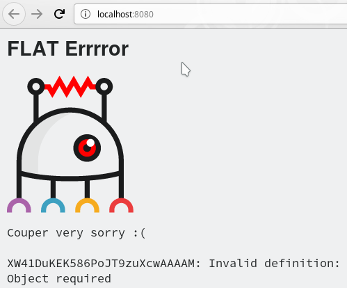
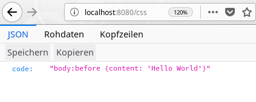

# Tutorial

_Hello World!_

So you're new on your job and your boss wants you to create an API for accessing programming language code snippets.

The design and frontend teams are already working on the user interface and can't wait to access the API you're about to create.

There you go! This tutorial helps you create a REST API for "Hello World" code snippets based on 
[FLAT](../README.md).

## Tools

FLAT is supplied as a [Docker](/administration/docker.md) image, so please make sure you have Docker installed on your system.

We assume you have the `curl` command line tool installed, too, which comes in handy when
working with REST APIs. The [`jq` JSON processor](https://stedolan.github.io/jq/)
is a useful tool when working with JSON.

Running the FLAT Docker image is dead easy thanks to the
[FLAT CLI](../reference/flat-cli.md).

Please download the script from the [FLAT CLI repository](https://github.com/sevenval/flat-cli),
make it executable and put the script in your `$PATH`:

```bash
$ curl -O https://raw.githubusercontent.com/sevenval/flat-cli/master/flat
$ chmod +x flat
$ sudo mv flat /usr/local/bin
```

> 📎
> You could also put `flat` into your `~/bin/` directory. If that is not
> already in your `$PATH`, you can add it with `export PATH="$PATH:~/bin"`.

## Getting Started

Let's create a workspace for our little project. We call it `hello-world` and create a directory with that name:

```bash
$ mkdir ~/hello-world
```

Let's try to start FLAT:

```bash
$ flat start ~/hello-world
No FLAT app found in ~/hello-world: create swagger.yaml to start
```

Before we can start FLAT, we need an API definition. The default location is `./swagger.yaml`. To get the server up and running, an empty one will do the job:

```bash
$ touch ~/hello-world/swagger.yaml
```

Now you can start FLAT like this

```bash
$ flat start ~/hello-world
```

or from within the working directory:

```bash
$ cd ~/hello-world
$ flat start
```

> 📎
> You can choose a port other than 8080 with the `-p` option, for example
> `flat start -p 8000`

> 📎
> If you haven't already guessed: You can stop FLAT at any time as usual by pressing
> <kbd>Ctrl</kbd> + <kbd>C</kbd> in its terminal.


Point your web browser to http://localhost:8080/ and see FLAT in action:



Or use `curl` on the command line in a new terminal:

```bash
$ curl localhost:8080
XNlS3M0L3o-5iHrwuGgNJQAAAI0: Invalid definition: swagger.yaml
Object required
```

## OpenAPI

Looks like an empty definition isn't all that useful after all.

We will need at least a minimal [OpenAPI definition](https://swagger.io/docs/specification/2-0/basic-structure/)
in our `swagger.yaml` to avoid that error page.

Currently, FLAT supports OpenAPI 2.0 also known as Swagger:

```yaml
swagger: "2.0"
info:
  version: "1.0"
  title: Hello World!
paths:
  /:
```

> 📎
> OpenAPI definitions can be written in YAML or JSON.
> We recommend YAML for brevity and readability.

Now we get a different error message:

```bash
$ curl localhost:8080
XNlTpvUrpUX@vMuN6J30rAAAAA8: No flow found for GET /
```

We'll get rid of it in the next section.

## In the Flow

The [_flow_](../reference/flow.md) feature of FLAT gives us full control over request and response processing.
Let's create a simple flow definition in `hello.xml` with an
[`echo` _action_](../reference/actions/echo.md) that produces a JSON snippet:

```xml
<flow>
  <echo mime="application/json">{"Hello":"World"}</echo>
</flow>
```

Then we assign that flow to the path `/` in our `swagger.yaml`.
With `x-flat-flow` we tell FLAT to start the `hello.xml` flow whenever `/` is being requested:

```yaml
…
paths:
  /:
    get:                     # ⬅
      x-flat-flow: hello.xml # ⬅
```

> 📎
> File paths are resolved relative to the location of the file they are referenced in. For `swagger.yaml` and `hello.xml` are in the same directory, we can simply use the filename here.

There we have our first "Hello World" snippet in JSON format:

```bash
$ curl --include localhost:8080
HTTP/1.1 200 OK
Date: Mon, 13 May 2019 11:48:35 GMT
Server: FLAT
Content-Length: 17
Content-Type: application/json

{"Hello":"World"}
```

Okay, let's parametrize our requests and add a second language for "Hello World" snippets: CSS.
First, we add a _path parameter_ for the `language` to the OpenAPI definition. That is,
the user has to provide the desired language in the request URI:

```yaml
…
paths:
  /{language}: # ⬅
    get:
      x-flat-flow: hello.xml
```

Then in our `hello.xml` we evaluate that path parameter to return the appropriate code snippet.
In the flow, path parameters can be accessed via `$request/params/…`. With the
[`<if>`/`<elseif>`/`<else>` control structure](../reference/flow.md#if-elseif-else-control-structure) we check the value of
`$request/params/language` and `echo` the respective snippet as JSON:

```xml
<flow>
  <if test="$request/params/language = 'json'">
    <echo mime="application/json">{"code": "{\"Hello\":\"World\"}"}</echo>
  </if>
  <elseif test="$request/params/language = 'css'">
    <echo mime="application/json">{"code": "body:before {content: 'Hello World'}"}</echo>
  </elseif>
  <else>
    <echo mime="application/json" status="404">{"code": "???"}</echo>
  </else>
</flow>
```



Did you notice how we change the HTTP status code to 404 when the requested
language is unsupported?

```bash
$ curl --include localhost:8080/foo
HTTP/1.1 404 Not Found
…
{"code": "???"}
```

> 📝
> **Exercise:** Enhance the above flow so that it can output a JavaScript code snippet as well.
>
> <details><summary>💡 Hint…</summary>
>
>```xml
>  …
>  </elseif>
>  <elseif test="$request/params/language = 'javascript'">
>    <echo mime="application/json">{"code": "console.log('Hello World')"}</echo>
>  </elseif>
>  <else>
>  …
>```
></details>

## Working with Files

Now we could add another language to our "Hello World" collection. And yet another, and…
– Wait! Someone must have done this before, right?

Right! "Hello World" code snippets for many computer languages can of course be found on [GitHub](https://github.com/leachim6/hello-world). The frontend developer team agrees that it would suffice if our API simply provides the URLs pointing to the code snippets rather than the snippets itself, for example

```json
{"url":"https://raw.githubusercontent.com/leachim6/hello-world/HEAD/c/css.css"}
```

To give the other team something to base their work on, we'll quickly set up some
mock responses. To keep our flow readable and [separate concerns](https://en.wikipedia.org/wiki/Separation_of_concerns) let's put the JSON responses into separate files:

```bash
$ mkdir ~/hello-world/files

$ cd ~/hello-world/files

$ echo '{"url":"https://raw.githubusercontent.com/leachim6/hello-world/blob/HEAD/j/json.json"}' > json.json

$ echo '{"url":"https://raw.githubusercontent.com/leachim6/hello-world/HEAD/c/css.css"}' > css.json

$ echo '{"url":"https://raw.githubusercontent.com/leachim6/hello-world/HEAD/j/javascript.js"}' > javascript.json
```

We replace our previous flow in `hello.xml` with a new one that accesses these files:

```xml
<flow>
  <copy in="{concat('./files/', $request/params/language, '.json')}" out="$json"/>

  <if test="$json">
    <dump in="$json"/>
  </if>
  <else>
    <echo mime="application/json" status="404">{"error": "Unknown language."}</echo>
  </else>
</flow>
```

With the help of the `concat` function, the [`copy` action](../reference/actions/copy.md) assembles a filename
from the requested language and loads the file's content into the `$json` variable.
If `$json` is not empty, the [`dump` action](../reference/actions/dump.md) then sends the content of `$json` as response.
Otherwise the [`echo` action](../reference/actions/echo.md) emits an error.

```bash
$ curl --include localhost:8080/css
HTTP/1.1 200 OK
…
Content-Type: application/json

{"url":"https://raw.githubusercontent.com/leachim6/hello-world/HEAD/c/css.css"}
```

```bash
$ curl --include localhost:8080/foo
HTTP/1.1 404 Not Found
…
Content-Type: application/json

{"error": "Unknown language"}
```

Great! The frontend guys are happy that they can already request our rudimentary API while
they are developing the UI for it.

Let's take another look at the code. Is it completely safe to use the `$request/params/language`
as we did above? Of course it's not! Using input from the client without proper sanitizing beforehand is always dangerous!

> 📝
> **Exercise:** "Hack" our API to gain access to arbitrary files in your app directory, for example the `swagger.yaml` file.
>
> <details><summary>💡 Hint…</summary>
>
> Access to any file in our `~/hello-world` directory is possible by stuffing the whole file path into the
> `language` path parameter so that the filename assembled by the `concat` function above looks like `files/../swagger.yaml#.json`.
>
> Forward slashes have to be URL encoded as `%2f`, the hash tag `#` for stripping off the `.json` filename extension has to be encoded as `%23`. Instead of `%23` you could also use `%3f` for `?` or `%3b` for `;` here:
>
>```bash
>$ curl http://localhost:8080/..%2fswagger.yaml%23
>swagger: "2.0"
>info:
>  version: "1.0"
>  title: Hello World!
>…
>```
> Never use user input without checking it first!
></details>

## Request Validation

We should fix that security threat by denying such potentially malicious requests.
One simple solution would be to allow alphanumeric characters for the language parameter only.
The [`matches` function](../reference/functions/matches.md) helps with that:

```xml
<flow>
  <if test="not(matches($request/params/language, '^[a-zA-Z0-9]+$'))">
    <echo mime="application/json" status="400">{"error": "Input validation failed!"}</echo>
  </if>
  …
```

Now we get:

```bash
$ curl --include http://localhost:8080/..%2fswagger.yaml%23
HTTP/1.1 400 Bad Request
…
{"error": "Input validation failed!"}
```

Okay, that works! But request validation is something that is supposed to be
done with the help of the OpenAPI definition. So we better put it in our `swagger.yaml`:

```yaml
      …
      x-flat-flow: hello.xml
      # ⬇ ⬇ ⬇
      parameters:
        - name: language
          in: path
          required: true
          type: string
          pattern: ^[a-zA-Z0-9]+$
```

Then we have to enable the request validation feature in the top-level section of `swagger.yaml`:

```yaml
swagger: "2.0"
info:
  version: "1.0"
  title: Hello World!
x-flat-validate:         # ⬅
  request: true          # ⬅
…
```

Let's try again:

```bash
$ curl --silent localhost:8080/..%2fswagger.yaml%23 | jq
{
  "error": {
    "message": "Client request validation failed",
     …
    "info": [
      "Pattern constraint violated in path for language: '../swagger.yaml#' does not match the pattern '^[a-zA-Z0-9]+$.'"
    ]
  }
}
```

> 📎
> Note how we "pipe" the response from `curl` through the `jq` command to get formatted JSON output.

Having verified that the built-in error message was triggered, we can now remove our homegrown request validation from the flow.

## Working with Templates

It's time to gradually move away from our local mock responses and deal with some real
data from the [`hello-world` repository at GitHub](https://github.com/leachim6/hello-world).
A suitable search request against the GitHub API for the C programming language for example looks like:

```bash
$ curl 'https://api.github.com/search/code?q=hello+repo:leachim6/hello-world+filename:C+language:C'
{
  "total_count": 4,
  "incomplete_results": false,
  "items": [
    {
      "name": "c.c",
      "path": "c/c.c",
      …
      "html_url": "https://github.com/leachim6/hello-world/blob/4b5ff1ef90ceb442f5633fc9e5d28297ac0f69ff/c/c.c",
      "repository": {
        …
      },
      "score": 12.970036
    },
    …
  ]
}
```

Whoa – that's a lot to take in! Most of that 22 kB JSON response is irrelevant for us. Only the `html_url` field of the top-most ranked search result is the one that's interesting.

As a first step, we store that JSON as a mock for an upstream response:

```bash
$ curl --output ~/hello-world/files/mock.json 'https://api.github.com/search/code?q=hello+repo:leachim6/hello-world+filename:C+language:C'
```

In the flow, we load that `mock.json` file with `copy` and throw away all unwanted fields and search results with the help of a [`template` action](../reference/actions/template.md):

```xml
<flow>
  <!-- ⬇ ⬇ ⬇ -->
  <copy in="files/mock.json"/>

  <template out="$url">{{ items/value[1]/html_url ?? "" }}</template>

  <if test="$url">
    <template in="$url">{"url": {{ . }}}</template>
  </if>
  <!-- ⬆ ⬆ ⬆ -->
  <else>
  …
```

Let's take a closer look. The `copy` action has no explicit `out="…"` and the following  `template` has no `in`. That means, the latter operates on the output of `copy` which is the content of our `mock.json` representing the body of the upstream response.
The `template` action evaluates the expression between `{{` and `}}` and stores its result in the variable `$url` as set by `out`. The expression itself extracts the wanted `html_url` property from the first object of the `items` array (`items/value[1]`).
If that property does not exist, the [Null Coalescing Operator `??`](/reference/templating/null-coalescing-operator.md) sets the empty string `""` as the result.

The rest of the flow is only slightly modified: We now check if we have content in `$url` and create the final JSON response with a second `template`. If `$url` is empty, we send the error response as before.

> 📎
> Instead of using the `$url` variable as input (`in="$url"`) in the second template and operating on its content, we could have accessed `$url`
> directly _inside_ the template:
>
> ```xml
>   <!--         ⬇             ⬇ -->
>   <template in="">{"url": {{ $url }}}</template>
> ```
>
> Note that we now explicitly omit the input using `in=""` to prevent
> the unwanted default input from being loaded – which happens to be the huge
> JSON output from the `copy` action.

Here's the result:

```bash
$ curl localhost:8080/c
{"url": "https://github.com/leachim6/hello-world/blob/4b5ff1ef90ceb442f5633fc9e5d28297ac0f69ff/c/c.c"}
```

## Upstream Requests

Now let's send a real request. Thanks to FLAT that is easy:
The [`request` action](../reference/actions/request.md) sends an HTTP request to an upstream server and provides us
with the response.
The upstream URL is built with `concat`: As with the `curl` command from above we search for files containing the word `hello` in the `leachim6/hello-world` repository on GitHub.
Now we want the filename and the language to match our `$request/params/language` parameter.
For starters we simply [`dump`](../reference/actions/dump.md) the upstream response to see what we're dealing with.
We also remove the `copy` action from above for now – we'll get back to it later on:

```xml
<flow>
  <request>
    {
      "url" : {{ concat("https://api.github.com/search/code",
                        "?q=hello",
                        "+repo:leachim6/hello-world",
                        "+filename:", $request/params/language,
                        "+language:", $request/params/language) }}
    }
  </request>
  <dump/>

  <template out="$url">{{ items/value[1]/html_url ?? "" }}</template>
  …
</flow>
```

> 📎
> `dump` has no explicit `in` here and just takes the output of `request`.

Requesting `/C` should result in the same 22 kB JSON response as [before](#working-with-templates) – again formatted with `jq` for readability:

```bash
$ curl --silent localhost:8080/C | jq
```

However, requests for other languages such as `/html` or `/Java` are now possible, too.
So let's remove that `dump` action again and send another request:

```bash
$ curl --silent localhost:8080/html
{"url": "https://github.com/leachim6/hello-world/blob/4b5ff1ef90ceb442f5633fc9e5d28297ac0f69ff/h/html.html"}
```

Almost! We now get in fact a filtered response from GitHub, but we've missed a tiny detail:
The URL points to the HTML page with the code snippet on it instead of the snippet itself.

> 📝
> **Exercise:** Use another `template` action with appropriate [string functions](../reference/functions/README.md#string-functions) to modify `$url` so that it points to
> the _Raw_ view on `raw.githubusercontent.com`.
>
> <details><summary>💡 Hint…</summary>
>
>```xml
>  …
>  <if test="$url">
>    <template in="$url" out="$url">
>     {{ concat('https://raw.githubusercontent.com/leachim6/hello-world',
>               substring-after(., '/blob'))
>     }}
>    </template>
>    <template in="$url">{"url": {{ . }}}</template>
>  </if>
>  …
>```
>
> Or, if you prefer using regular expressions:
>
>```xml
>    <template in="$url" out="$url">
>      {{ replace(., "^.*/blob", "https://raw.githubusercontent.com/leachim6/hello-world")
>      }}
>    </template>
>```
> </details>

Great! Now that we've fixed that and `$url` references the right destination,
we can use `curl` to fetch a URL –
and immediately load the respective "Hello World" code snippet afterwards:

```bash
$ curl "$(curl --silent localhost:8080/html | jq --raw-output .url)"
<!DOCTYPE html>
<html>
  <head>
    <title>Hello World HTML</title>
  </head>
  <body>
    <h1>Hello World</h1>
  </body>
</html>
```

## Mock, mock!

Often, the upstream API responses we build our applications upon are not cacheable at all. Therefore, they have to be fetched
over and over again in every test run during development. Downloading large responses takes some time. Especially when dealing with a small scale upstream server, for example a test system, heavy testing may result in significant load and traffic on that system.

Hence, loading a local mock file with `copy` instead of waiting for a complete request/response
cycle of a real remote API call can speed up development notably.
So it might pay off to work with local mocks whenever possible. The following flow snippet featuring our `copy` action from before illustrates how this could look like:

```xml
<flow>
  <if test="$request/get/mock or $request/headers/mock">
    <!-- Use mock.json when requested for example with "?mock" or the header "Mock: 1" -->
    <copy in="files/mock.json"/>
  </if>
  <else>
    <request>
      …
    <request>
  </else>
  …
```

> 📎
> Note that in `$request/headers` the header field names are lower-case.

Both

```bash
$ curl 'localhost:8080/html?mock'
```

and

```bash
$ curl --header Mock:1 localhost:8080/html
```

now return the URL from our local `mock.json` actually pointing to the C version of "Hello World".

> 📎
> Sending the header `Mock: true` will lead to different behavior as it enables FLAT's [built-in mock feature](../cookbook/builtin-mocking.md)
> which allows you to specify mock responses in the OpenAPI defintion.

## Response Validation

To ensure that we don't break our API while we are developing it further, let's validate our responses, too. To do so, we add another schema for our own API responses to our `swagger.yaml`. That schema requires that the
`url` property exist in the response and point to `raw.githubusercontent.com`.

```yaml
    …
    get:
      x-flat-flow: hello.xml
      parameters:
        - name: language
          …
          pattern: ^[a-zA-Z0-9]+$
      # ⬇ ⬇ ⬇
      produces:
        - application/json
      responses:
        200:
          description: URL to a "Hello World" snippet
          schema:
            type: object
            required:
              - url
            properties:
              url:
                type: string
                pattern: ^https://raw.githubusercontent.com/
```

As before, the validation must be enabled in the top-level section:

```yaml
swagger: "2.0"
info:
  version: "1.0"
  title: Hello World!
x-flat-validate:
  request: true
  response: true         # ⬅
…
```

If we now alter the domain name in the second template of our flow to `flaw.githubusercontent.com`, we get a validation error:

```bash
$ curl --silent localhost:8080/javascript | jq
{
  "error": {
    "message": "Output Validation Failed",
    "status": 500,
    "requestID": "XNrzofUrpUX@vMuN6J31EwAAADQ",
    "info": [
      "Pattern constraint violated in body for code: Does not match the regex pattern ^https://raw.githubusercontent.com/."
    ]
  }
}
```

## Request Configuration

Instead of assembling the request URL with `concat`, we can configure it.
For better readability, we first move the request part into a
[`sub-flow`](../reference/actions/sub-flow.md) –
a separate flow file that can be called from others flows like a subroutine:

```xml
<flow>
  …
  <else>
    <sub-flow src="upstream_request.xml"/>
  </else>
  …
```

The `request` action now resides in `upstream_request.xml`:

```xml
<flow>
  <request>
    {
      "url": {{ concat("https://api.github.com/search/code",
                        "?q=hello",
                        "+repo:leachim6/hello-world",
                        "+filename:", $request/params/language,
                        "+language:", $request/params/language) }}
    }
  </request>
</flow>
```

We can change that into the following, more readable code by using the
[`join` function](../reference/functions/join.md)
on the individual `$query_parameters` to set the
[`query` property of our `request` action](../reference/actions/request.md#query):

```xml
<flow>
  <template out="$query_parameters">
    [
      "q=hello",
      "repo:leachim6/hello-world",
      {{ concat("filename:", $request/params/language) }},
      {{ concat("language:", $request/params/language) }}
    ]
  </template>

  <request>
    {
      "url": "https://api.github.com/search/code",
      "query": {{ join(" ", $query_parameters) }}
    }
  </request>
</flow>
```

## Upstream Validation

Besides validating incoming requests and the response our API generates, we can also enable validation
for our upstream request to GitHub and the associated response.

So let's enhance our request configuration in `upstream_request.xml` with some validation
[`options`](../reference/actions/request.md#options):

```xml
      …
      "query": {{ join(" ", $query_parameters) }},
      {{// ⬇ ⬇ ⬇                                 ⬆ comma }}
      "options": {
        "definition": "upstream.yaml",
        "validate-request": true
      }
      {{// ⬆ ⬆ ⬆ }}
    }
  </request>
</flow>
```

Furthermore, we need a second OpenAPI definition file (`upstream.yaml`)
that describes valid upstream requests along with the expected responses:

```yaml
swagger: "2.0"
info:
  version: "1.0"
  title: GitHub Search API
host: api.github.com
schemes:
  - https
paths:
  /search/code:
    get:
      parameters:
        - name: q
          in: query
          required: true
          type: string
          pattern: .
```

So far, this one checks that the query string actually contains a `q` parameter with an arbitrary string value.

> 📝
> **Exercise:** Change the regular expression in `pattern` so that any invalid request query string is rejected with
> a `Pattern constraint violated in query for q` error in the FLAT runner log.
>
> <details><summary>💡 Hint…</summary>
>
> `pattern: ^hello repo:leachim6/hello-world filename:\w+ language:\w+$`
> </details>

Excellent! Now the validation will ruthlessly reveal our mistakes, when we continue working on our request configuration.

Next, we'll take care of the responses: We enable validation for upstream responses

```xml
        …
        "validate-request": true, {{// ⬅ comma }}
        "validate-response": true {{// ⬅ }}
      }
    }
  </request>
</flow>
```

which we expect to be something like `{ "total_count": <integer>, "items": [ … ] }`:

```yaml
          …
          pattern: …
      # ⬇ ⬇ ⬇
      produces:
        - application/json
      responses:
        200:
          description: GitHub code search results
          schema:
            type: object
            required:
              - total_count
              - items
            properties:
              total_count:
                type: integer
              items:
                type: array
```

Now we'd immediately notice if GitHub changed relevant parts of its API that affect our
"Hello World" API built on top of it.

To abort the flow in case the upstream request or response is invalid or the request fails outright, we add the `exit-on-error` request option:

```xml
        …
        "validate-response": true, {{// ⬅ comma }}
        "exit-on-error": true      {{// ⬅ }}
      }
    }
  </request>
```

To see the effect, change the parameter name `language` to `lang` in upstream_request.xml:

```xml
      …
      {{ concat("lang:", $request/params/language) }}
      <!--       ⬆ ⬆ ⬆ -->
    ]
  </template>
```

If we request our API
```
curl -si localhost:8080/html
```

instead of the output

```
HTTP/1.1 404 Not Found
…
```
```
{"error": "Unknown language"}
```

we now get

```
HTTP/1.1 400 Bad Request
…
```
```json
{"error":{"message":"Upstream Request Validation Failed","status":400,"requestID":"main","info":["Pattern constraint violated in query for q: 'hello repo:leachim6\/hello-world filename:html lang:html' does not match the pattern '^hello repo:leachim6\/hello-world filename:\\w+ language:\\w+$'."],"code":3202}}
```

If you prefer to provide a custom error document, you can configure an error flow. Just create `error.xml`:

```xml
<flow>
  <template>
    {
      "CustomError":  {
        "Message": {{ $error/message }},
        "Info": {{ $error/info }}
      }
    }
  </template>
  <set-response-headers>
    {
      "Status": {{ $error/status }},
      "Error-Code": {{ $error/code }}
    }
  </set-response-headers>
</flow>
```

and reference it on the top level in `swagger.yaml`:

```yaml
…
x-flat-error:           # ⬅
  flow: error.xml       # ⬅ error flow
…
```

We now get

```
HTTP/1.1 400 Bad Request
…
Error-Code: 3202
…
```
```json
{"CustomError":{"Message":"Upstream Request Validation Failed","Info":["Pattern constraint violated in query for q: 'hello repo:leachim6\/hello-world filename:html lang:html' does not match the pattern '^hello repo:leachim6\/hello-world filename:\\w+ language:\\w+$'."]}}
```

Now revert the change to upstream_request.xml:

```xml
      …
      {{ concat("language:", $request/params/language) }}
      <!--       ⬆ ⬆ ⬆ -->
    ]
  </template>
```


## Improving the Configuration

Currently we send an error response if our template expression
`{{ items/value[1]/html_url ?? "" }}` yields an empty string. A more straightforward way would be to simply check the number of results (`total_count`) that are returned:

```xml
<flow>
  <if test="$request/get/mock or $request/headers/mock">
  …
  </else>

  <!-- ⬇ ⬇ ⬇ -->
  <template out="$count">{{ total_count ?? 0 }}</template>
  <if test="$count > 0">
    <template out="$url">
      {{ concat('https://raw.githubusercontent.com/leachim6/hello-world',
                substring-after(items/value[1]/html_url, '/blob')) }}
    </template>

    <template in="$url">{"url": {{ . }}}</template>
  </if>
  <!-- ⬆ ⬆ ⬆ -->
  <else>
  …
```

As before, the `template` for `$count` operates on the result of the previous request and therefore has no `in="…"`.

Now we can completely do away with the `else` block if we change the above condition into `0 >= $count` as the
[`echo` action](../reference/actions/echo.md) already finishes the request:

```xml
  …
  <if test="0 >= $count">
    <echo mime="application/json" status="404">{"error": "Unknown language"}</echo>
  </if>

  <template out="$url">
    {{ concat('https://raw.githubusercontent.com/leachim6/hello-world',
              substring-after(items/value[1]/html_url, '/blob')) }}
  </template>

  <template in="$url">{"url": {{ . }}}</template>
</flow>
```

> 📝
> **Exercise:** Maybe the condition `0 >= $count` hurts your eyes, too. Swap the operands
> and use an appropriate comparison operator: `$count … 0` Beware – we're in XML land here!
>
> <details><summary>💡 Hint…</summary>
>
> To keep the XML well-formed when checking `$count <= 0` we have to XML encode the `<` becoming `&lt;`:
>
>```xml
>  …
>  <if test="$count &lt;= 0">
>    <echo …>…</echo>
>  </if>
>  …
>```
>
> Yeah – that's even worse! Less accurate, but probably sufficient may be just `$count = 0`.
> Or maybe `not($count > 0)`. You get the idea. Let's stick with `$count = 0`.
> </details>

Next, we are going to make the lengthy `concat` expression more readable by introducing
[template variables](../reference/templating/variable.md).
That leaves us with one single `template` action producing the final output:

```xml
  …
  </if>

  <template>
    {{$repo_url  := "https://raw.githubusercontent.com/leachim6/hello-world" }}
    {{$file_path := substring-after(items/value[1]/html_url, '/blob') }}

    {"url": {{ concat($repo_url, $file_path) }}}
  </template>
</flow>
```

Or, if you chose the regular expression solution above, you might prefer keeping the `replace` function:

```xml
  <template>
    {{$repo_url := "https://raw.githubusercontent.com/leachim6/hello-world" }}

    {"url": {{ replace(items/value[1]/html_url, "^.*/blob", $repo_url) }}}
  </template>
```

## When Things Go South

Consider the following situation: After a few weeks of live operation, your manager calls and informs you that the "Hello World" API has stopped functioning. He urges you to fix it as soon as possible. Let's see for ourselves:

```bash
$ curl localhost:8080/html
{"error": "Unknown language"}
```

_Sigh!_ So how do we find out what is going wrong?

In the default setup, the FLAT runner only logs severe errors to the log file and outputs them on the command line. If we want to get more information about what's happening, we have to change FLAT's debug settings. On startup, we can either set the environment variable
`$FLAT_DEBUG`

```bash
$ FLAT_DEBUG='*:debug:log' flat start ~/hello-world
```

or use the `-d` option

```bash
$ flat start -d '*:debug:log' ~/hello-world
```

> 📎
> Mind the `'` quoting to prevent the shell from expanding `*`.

Both commands start FLAT with the [debug log level](../reference/debugging.md) lowered from `error` to `debug`.
The `*` stands for any topic. `log` means that debug information will be written to the log file.

> 📎
> `'*:debug:log'` is in fact the same as if we've just written `'*:debug'` or even `'*'`.

So when we now request our API, a lot of information from the log file will be output on the terminal where we started FLAT. We can now browse through that pile of text or use a more specific topic. For example, if we were only interested in messages related to our `template` and `echo` actions we could set the debug topic to `template,echo`:

```bash
$ flat start -d template,echo ~/hello-world
```

However, changing the default debug settings and restarting FLAT every time is not the proper way to go. Instead, we can simply send an appropriate `Debug` header with our request:

```bash
$ curl --header Debug:template,echo localhost:8080/html
```

If we also set the debug sink to `inline` or `append`, the output
will be included in the HTTP response rather than the log file, for example:

```bash
$ curl --header Debug:time:debug:inline localhost:8080/html
```

The latter is the only reasonable way to debug on a production system where we usually can't access the log file.
While the [`flat` command line tool](/reference/flat-cli.md) enables header debugging by default,
the appropriate environment variables must be set to enable it in other environments, typically
[`$FLAT_DEBUG_AUTH`](/administration/configuration.md).

> 📎
> If the `$FLAT_DEBUG_AUTH` environment variable is set (this is a **must** on production systems!), FLAT requires a password to enable debugging by means of the `Debug` header, for example `--header 'Debug: *:warn:append; auth=Pa5sw0rd'`.

Besides the built-in debug information, custom debug output can help understand the flow process. The [`debug` action](../reference/actions/debug.md) enables us to insert our own log lines into the flow, for example

```xml
<flow>
  <debug level="info" in="$request"/>
  …
```

## Complete Configuration

Here are the complete configuration files:

### `hello.xml`

```xml
<flow>
  <if test="$request/get/mock or $request/headers/mock">
    <!-- Use mock.json when requested for example with "?mock" or the header "Mock: 1" -->
    <copy in="files/mock.json"/>
  </if>
  <else>
    <sub-flow src="upstream_request.xml"/>
  </else>

  <template out="$count">{{ total_count ?? 0}}</template>

  <if test="$count = 0">
    <echo mime="application/json" status="404">{"error": "Unknown language"}</echo>
  </if>

  <template>
    {{$repo_url  := "https://raw.githubusercontent.com/leachim6/hello-world" }}
    {{$file_path := substring-after(items/value[1]/html_url, '/blob') }}

    {"url": {{ concat($repo_url, $file_path) }}}
  </template>
</flow>
```

### `upstream_request.xml`

```xml
<flow>
  <template out="$query_parameters">
    [
      "q=hello",
      "repo:leachim6/hello-world",
      {{ concat("filename:", $request/params/language) }},
      {{ concat("language:", $request/params/language) }}
    ]
  </template>

  <request>
    {
      "url": "https://api.github.com/search/code",
      "query": {{ join(" ", $query_parameters) }},
      "options": {
        "definition": "upstream.yaml",
        "validate-request": true,
        "validate-response": true,
        "exit-on-error": true
      }
    }
  </request>
</flow>
```

### `swagger.yaml`

```yaml
swagger: "2.0"
info:
  version: "1.0"
  title: Hello World!
x-flat-validate:
  request: true
  response: true
x-flat-error:
  flow: error.xml
paths:
  /{language}:
    get:
      x-flat-flow: hello.xml
      parameters:
        - name: language
          in: path
          required: true
          type: string
          pattern: ^[a-zA-Z0-9]+$
      produces:
        - application/json
      responses:
        200:
          description: URL to a "Hello World" snippet
          schema:
            type: object
            required:
              - url
            properties:
              url:
                type: string
                pattern: ^https://raw.githubusercontent.com/
```

### `upstream.yaml`

```yaml
swagger: "2.0"
info:
  version: "1.0"
  title: GitHub Search API
host: api.github.com
schemes:
  - https
paths:
  /search/code:
    get:
      parameters:
        - name: q
          in: query
          required: true
          type: string
          pattern: ^hello repo:leachim6/hello-world filename:\w+ language:\w+$
      produces:
        - application/json
      responses:
        200:
          description: GitHub code search results
          schema:
            type: object
            required:
              - total_count
              - items
            properties:
              total_count:
                type: integer
              items:
                type: array
```

### `error.xml`

```xml
<flow>
  <template>
    {
      "CustomError":  {
        "Message": {{ $error/message }},
        "Info": {{ $error/info }}
      }
    }
  </template>
  <set-response-headers>
    {
      "Status": {{ $error/status }},
      "Error-Code": {{ $error/code }}
    }
  </set-response-headers>
</flow>
```
